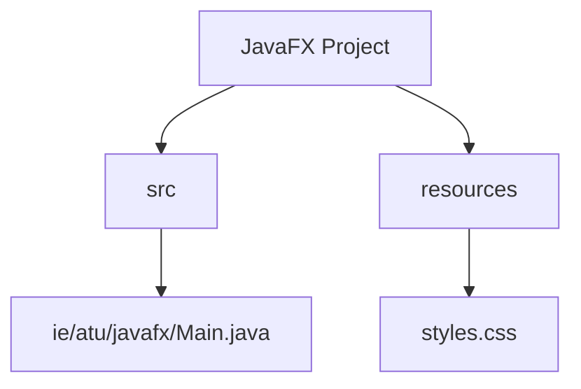
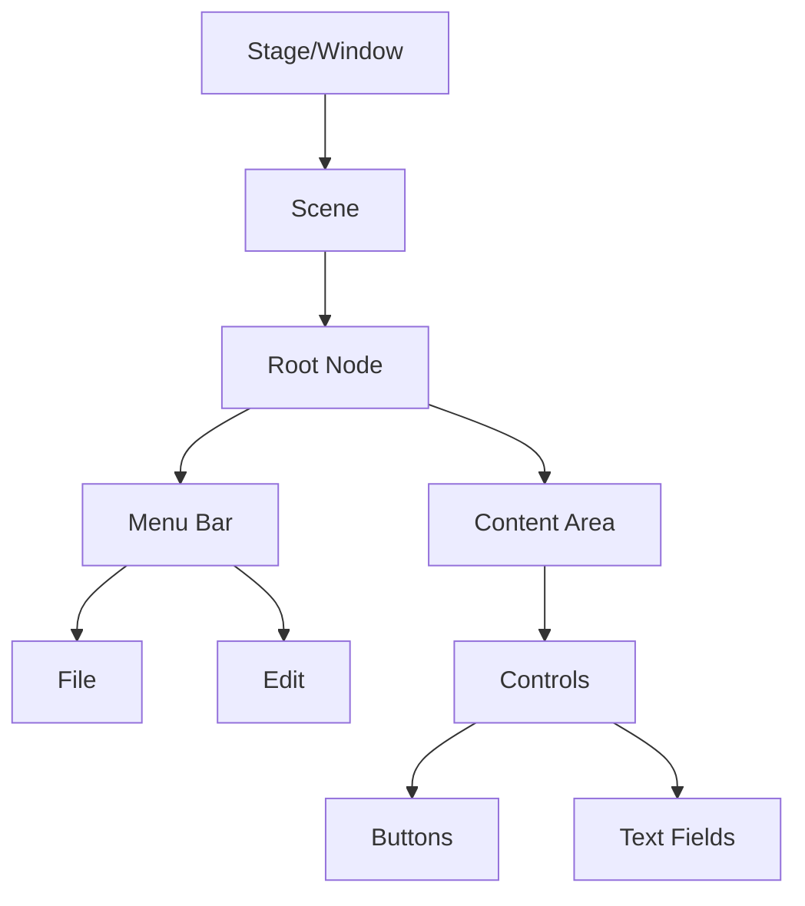
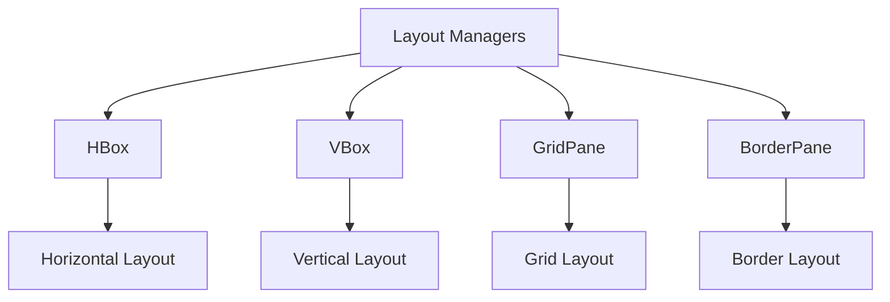

[](https://classroom.github.com/open-in-codespaces?assignment_repo_id=17397508)
# JavaFX Introduction Lab: Building Modern Desktop Applications

## Table of Contents

1. [Project Setup](#1-project-setup)
2. [Understanding JavaFX Fundamentals](#2-understanding-javafx-fundamentals)
3. [Creating Your First JavaFX Application](#3-creating-your-first-javafx-application)
4. [Working with Layouts](#4-working-with-layouts)
5. [Event Handling Basics](#5-event-handling-basics)
6. [Styling and CSS](#6-styling-and-css)

## 1. Project Setup

In the world of desktop application development, organization is key to creating maintainable and scalable applications. Before we dive into creating JavaFX applications, let's first understand how to structure our project effectively.

I'll simplify the project structure section to focus just on what we need for this lab:

### 1.1 Project Structure

For this lab, we'll keep our project structure simple with just the essential files. We'll have one main Java file containing all our JavaFX code and a CSS file for styling:



Our `Main.java` file will contain all the JavaFX application code - the windows, buttons, and event handlers we create. The `styles.css` file will help us make our application look polished by defining colors, fonts, and other visual properties.

Think of it like putting on a simple play: rather than having elaborate backstage organization, we have one main script (`Main.java`) and one costume design document (`styles.css`). This straightforward setup lets us focus on learning JavaFX fundamentals without getting caught up in complex project organization.

### 1.2 DIY Task 1: Create Project Structure

Let's set up our JavaFX project step by step. We'll create a clean, organized structure that will serve as the foundation for our application development.

Follow these steps:

1. Create a package named `ie.atu.javafx`
2. Create a Main class in this package with the following starter code:

```java
package ie.atu.javafx;

import javafx.application.Application;
import javafx.stage.Stage;

public class Main extends Application {
    
    @Override
    public void start(Stage primaryStage) {
        // This method is where we'll begin building our UI
        System.out.println("JavaFX Application Started");
    }

    public static void main(String[] args) {
        launch(args);
    }
}
```

3. Run this code to verify your JavaFX setup is working correctly. You should see the output below, confirming that your development environment is properly configured:

```
JavaFX Application Started
```

4. Create a `resources` folder at the same level as your src folder. This folder will be used later to store our application resources such as images, CSS files, and other assets.

Your project structure should now look like this:

```
YourProject
├── src
│   └── ie
│       └── atu
│           └── javafx
│               └── Main.java
└── resources
    └── styles.css
```

While our first program doesn't show a window yet, we've laid the foundation for our application and verified that everything is working correctly. The Main class extends `Application`, which is the core class for all JavaFX applications. The `start()` method is where we'll begin building our user interface in the upcoming sections.

## 2. Understanding JavaFX Fundamentals

Before we start building interfaces, it's essential to understand the core concepts that make JavaFX work. Think of JavaFX as a theater production system, where different components work together to create a complete show.

### 2.1 The Theater Metaphor

JavaFX uses a theater metaphor that makes its structure intuitive to understand:

1. **Stage (Window)**: Like a physical theater stage, this is where everything happens. In JavaFX, the Stage represents your application window.

2. **Scene (Content)**: Just as a play has different scenes, a JavaFX application can have multiple scenes. Each Scene represents a complete user interface that can be displayed in your window.

3. **Scene Graph**: This is your scene's hierarchy of elements, like the organization of props and actors on a stage. It's a tree-like structure where each element can contain other elements.



### 2.2 Understanding Nodes

In JavaFX, everything you see in your application is a node. Nodes are the building blocks of your interface, similar to how actors and props make up a theater scene. There are two main types of nodes:

1. **Parent Nodes**: These can contain other nodes
   - VBox (vertical container)
   - HBox (horizontal container)
   - GridPane (grid layout)
   - StackPane (layered layout)

2. **Child Nodes**: These are the actual UI elements
   - Button
   - Label
   - TextField
   - ImageView

## 3. Creating Your First JavaFX Application

Now that we understand the basics, let's create our first real JavaFX application. We'll start simple and gradually add more features.

### 3.1 Hello JavaFX

Let's create a window that displays a welcome message:

```java
public class HelloJavaFX extends Application {
    
    @Override
    public void start(Stage primaryStage) {
        // Create the main content node
        Label welcomeLabel = new Label("Welcome to JavaFX!");
        welcomeLabel.setStyle("-fx-font-size: 20px;");
        
        // Create a container to hold our label
        StackPane root = new StackPane();
        root.getChildren().add(welcomeLabel);
        
        // Create and configure the scene
        Scene scene = new Scene(root, 300, 200);
        
        // Configure and show the stage
        primaryStage.setTitle("Hello JavaFX");
        primaryStage.setScene(scene);
        primaryStage.show();
    }
}
```

This will create a window that looks like this:

| Hello JavaFX                      |
|----------------------------------|
|                                  |
|     Welcome to JavaFX!           |
|                                  |
|----------------------------------|

Let's understand what each part does:
1. The Label is our content - the text we want to display
2. The StackPane is a container that centers its content
3. The Scene holds our layout
4. The Stage displays everything

### 3.2 DIY Task 2: Enhanced Welcome Screen

Now it's your turn to create something slightly more complex. Create a welcome screen that shows:
- A welcome message
- The current date and time
- Your name
- A simple image (we'll provide a sample)

Your result should look like this:

| Welcome to My App                 |
|----------------------------------|
|                                  |
|   👋 Welcome, [Your Name]!       |
|   📅 [Current Date]              |
|   🕒 [Current Time]              |
|                                  |
|----------------------------------|

## 4. Working with Layouts

Layout managers in JavaFX help us organize our interface elements in a structured way. Each layout manager serves a specific purpose and understanding them is key to creating well-organized interfaces.

### 4.1 Common Layout Managers

JavaFX provides several layout managers, each with its own specific use case:



Let's look at a practical example using GridPane to create a form:

```java
public class LoginForm extends Application {
    @Override
    public void start(Stage primaryStage) {
        // Create a grid layout
        GridPane grid = new GridPane();
        grid.setAlignment(Pos.CENTER);
        grid.setHgap(10);
        grid.setVgap(10);
        grid.setPadding(new Insets(25));
        
        // Add form elements
        Label usernameLabel = new Label("Username:");
        grid.add(usernameLabel, 0, 0); // column 0, row 0
        
        TextField usernameField = new TextField();
        grid.add(usernameField, 1, 0); // column 1, row 0
        
        Label passwordLabel = new Label("Password:");
        grid.add(passwordLabel, 0, 1); // column 0, row 1
        
        PasswordField passwordField = new PasswordField();
        grid.add(passwordField, 1, 1); // column 1, row 1
        
        Button loginButton = new Button("Login");
        grid.add(loginButton, 1, 2); // column 1, row 2
        
        // Create scene and show
        Scene scene = new Scene(grid, 300, 200);
        primaryStage.setTitle("Login Form");
        primaryStage.setScene(scene);
        primaryStage.show();
    }
}
```

This creates a professional-looking login form:

| Login Form                        |
|----------------------------------|
| Username: `[________________]`    |
| Password: `[________________]`    |
|          `[    Login     ]`      |
|----------------------------------|

### 4.2 DIY Task 3: Registration Form

Create a complete registration form using GridPane. Your form should validate input and provide feedback:

| Registration                      |
|----------------------------------|
| First Name: `[______________]`   |
| Last Name:  `[______________]`   |
| Email:      `[______________]`   |
| Password:   `[______________]`   |
| Confirm:    `[______________]`   |
|                                  |
|      `[    Register     ]`       |
|----------------------------------|

## 5. Event Handling Basics

Event handling is how we make our applications interactive. Every button click, key press, or mouse movement can trigger an event that our application can respond to.

### 5.1 Understanding Events

Events in JavaFX follow a specific flow:


Here's a simple example of event handling:

```java
public class Counter extends Application {
    private int count = 0;
    
    @Override
    public void start(Stage primaryStage) {
        // Create display
        Label countLabel = new Label("0");
        
        // Create buttons
        Button incrementButton = new Button("+");
        Button decrementButton = new Button("-");
        
        // Add event handlers
        incrementButton.setOnAction(e -> {
            count++;
            countLabel.setText(String.valueOf(count));
        });
        
        decrementButton.setOnAction(e -> {
            count--;
            countLabel.setText(String.valueOf(count));
        });
        
        // Create layout
        HBox layout = new HBox(10);
        layout.getChildren().addAll(decrementButton, 
                                  countLabel, 
                                  incrementButton);
        
        // Show the stage
        Scene scene = new Scene(layout, 200, 100);
        primaryStage.setScene(scene);
        primaryStage.show();
    }
}
```

This creates an interactive counter:

| Counter                          |
|---------------------------------|
|    `[ - ]`    0    `[ + ]`      |
|---------------------------------|

### 5.2 DIY Task 4: Interactive Calculator

Create a basic calculator with these features:
- Numeric buttons (0-9)
- Basic operations (+, -, *, /)
- Clear button
- Equal button
- Running display of calculations

## 6. Styling and CSS

JavaFX applications can be styled using CSS, similar to web development but with JavaFX-specific properties.

### 6.1 Basic Styling

You can style JavaFX elements in three ways:
1. Inline styles
2. Style classes
3. External stylesheets

Here's an example of each approach:

```java
// Inline styling
button.setStyle("-fx-background-color: #4CAF50; " +
                "-fx-text-fill: white;");

// Style class
button.getStyleClass().add("success-button");

// External stylesheet
scene.getStylesheets().add(getClass().getResource("/styles.css").toExternalForm());
```

```css
/* styles.css */
.success-button {
    -fx-background-color: #4CAF50;
    -fx-text-fill: white;
    -fx-font-size: 14px;
    -fx-padding: 8px 16px;
}

.success-button:hover {
    -fx-background-color: #45a049;
}
```

### 6.2 DIY Task 5: Styled Application

Style your calculator from Task 4 to look professional:

| Calculator                       |
|----------------------------------|
| `[_________________]`            |
|                                  |
| `[7]` `[8]` `[9]` `[÷]`         |
| `[4]` `[5]` `[6]` `[×]`         |
| `[1]` `[2]` `[3]` `[-]`         |
| `[0]` `[.]` `[=]` `[+]`         |
|----------------------------------|

## Summary and Next Steps

Congratulations! You've learned the fundamentals of JavaFX development:
- Project structure and organization
- Basic concepts (Stage, Scene, Nodes)
- Layout management
- Event handling
- Styling with CSS

Consider these next steps:
1. Explore FXML for UI design
2. Learn about properties and bindings
3. Implement data persistence
4. Add animations and transitions
5. Create more complex applications

## Additional Resources

1. Official JavaFX Documentation
2. Scene Builder for visual layout design
3. CSS Reference for JavaFX
4. Community Forums and Support

Remember: Practice is key to mastering JavaFX development. Try creating your own applications and experimenting with different features and layouts
