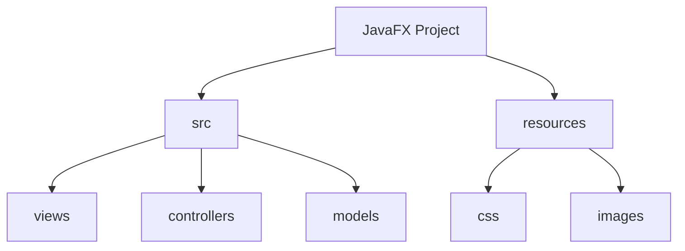
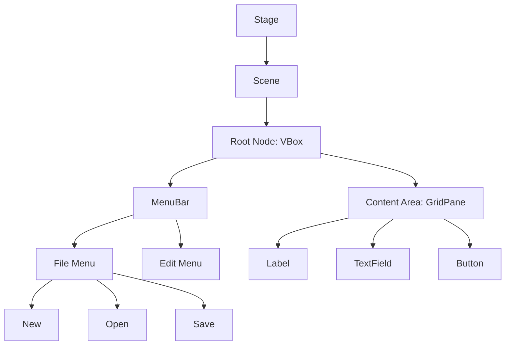
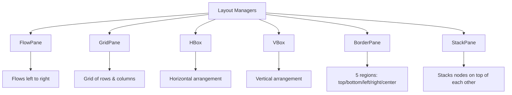
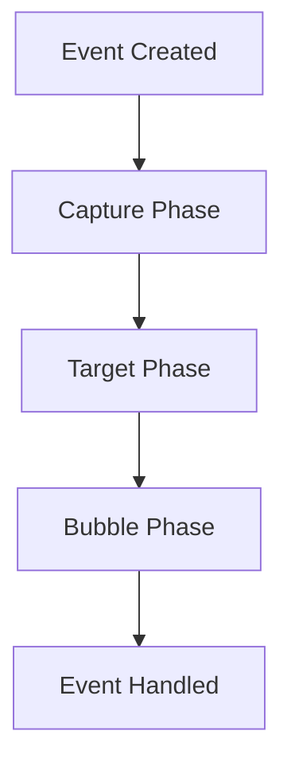

# JavaFX Introduction Lab

## Table of Contents

1. [Project Setup](#1-project-setup)
2. [Understanding JavaFX Fundamentals](#2-understanding-javafx-fundamentals)
3. [Creating Your First JavaFX Application](#3-creating-your-first-javafx-application)
4. [Working with Layouts](#4-working-with-layouts)
5. [Event Handling Basics](#5-event-handling-basics)
6. [Styling and CSS](#6-styling-and-css)

## 1. Project Setup

### 1.1 Project Structure

In JavaFX development, organizing your code properly is essential for maintaining a clean and scalable application. A well-structured JavaFX project typically includes separate directories for views, controllers, models, and resources like CSS files and images.



### 1.2 DIY Task 1: Create Project Structure

1. Create a package named `ie.atu.javafx`
2. Create a Main class with this starter code:

```java
package ie.atu.javafx;

import javafx.application.Application;
import javafx.stage.Stage;

public class Main extends Application {
    
    @Override
    public void start(Stage primaryStage) {
        // We'll add our JavaFX code here
        System.out.println("JavaFX Application Started");
    }

    public static void main(String[] args) {
        launch(args);
    }
}
```

3. Run this code to verify your JavaFX setup is working correctly.

<details>
<summary>Click to reveal expected output</summary>

```
JavaFX Application Started
```
</details>

## 2. Understanding JavaFX Fundamentals

### 2.1 Concept Introduction: Stage, Scene, and Scene Graph

JavaFX follows a theater metaphor for its visual components, which creates an intuitive mental model for understanding how different parts work together:

1. **Stage**: Think of this as the actual window of your application - like a theater stage where everything happens. It's the top-level container that provides the space where your application's content will be displayed.

2. **Scene**: This is what's currently being displayed on the stage - like a scene in a play. A stage can show different scenes, but only one at a time. The scene contains all the visual elements that make up your user interface.

3. **Scene Graph**: This is the hierarchical tree structure that represents all visual elements in your application. At the top is a root node, which can contain other nodes (children), creating a branching structure similar to a family tree. The scene graph determines how elements are organized, displayed, and manipulated.

4. **Nodes**: These are the individual elements in your scene - like actors and props on a stage. They can be:
   - Controls (Button, Label, TextField)
   - Containers (HBox, VBox, GridPane)
   - Shapes (Rectangle, Circle)
   - Custom components
   


The scene graph is crucial for understanding how JavaFX applications are structured. When you modify a parent node in the scene graph, those changes can affect all its children. For example, if you hide a VBox, all components inside it will become hidden as well. This hierarchical structure also influences:
- Event handling (events bubble up through the scene graph)
- Styling (CSS styles can cascade down to child nodes)
- Layout (parent nodes control the positioning of their children)
- Memory management (removing a parent node automatically removes all its children)

### 2.2 Code Example: Hello World Application

Let's create our first JavaFX application that displays "Hello, JavaFX!" in a window:

```java
package ie.atu.javafx.demo;

import javafx.application.Application;
import javafx.scene.Scene;
import javafx.scene.control.Label;
import javafx.scene.layout.StackPane;
import javafx.stage.Stage;

public class HelloWorld extends Application {
    
    @Override
    public void start(Stage primaryStage) {
        // Create a label node
        Label label = new Label("Hello, JavaFX!");
        
        // Create a layout pane (root node)
        StackPane root = new StackPane();
        
        // Add the label to the pane
        root.getChildren().add(label);
        
        // Create a scene with the pane
        Scene scene = new Scene(root, 300, 200);
        
        // Set the scene on the stage
        primaryStage.setScene(scene);
        
        // Set the stage title
        primaryStage.setTitle("My First JavaFX App");
        
        // Show the stage
        primaryStage.show();
    }
    
    public static void main(String[] args) {
        launch(args);
    }
}
```

### 2.3 DIY Task 2: Create a Welcome Screen

Create your own JavaFX application that:

1. Displays a welcome message
2. Shows your name
3. Includes the current date
4. Has a custom window title

<details>
<summary>Click to see expected result</summary>

Your application should display a window with centered text showing:
```
Welcome to My JavaFX Application
Created by [Your Name]
Current Date: [Today's Date]
```
</details>

## 3. Working with Layouts

### 3.1 Concept Introduction: Layout Managers

JavaFX provides several layout managers to help organize your user interface components. Each layout manager has its own specific way of arranging nodes:



### 3.2 Code Example: Working with GridPane

Let's create a simple login form using GridPane:

```java
package ie.atu.javafx.demo;

import javafx.application.Application;
import javafx.geometry.Insets;
import javafx.geometry.Pos;
import javafx.scene.Scene;
import javafx.scene.control.Button;
import javafx.scene.control.Label;
import javafx.scene.control.PasswordField;
import javafx.scene.control.TextField;
import javafx.scene.layout.GridPane;
import javafx.stage.Stage;

public class LoginForm extends Application {
    
    @Override
    public void start(Stage primaryStage) {
        // Create a GridPane layout
        GridPane grid = new GridPane();
        grid.setAlignment(Pos.CENTER);
        grid.setHgap(10);
        grid.setVgap(10);
        grid.setPadding(new Insets(25, 25, 25, 25));
        
        // Add components to the grid
        Label userName = new Label("User Name:");
        grid.add(userName, 0, 0);  // column=0, row=0
        
        TextField userTextField = new TextField();
        grid.add(userTextField, 1, 0);  // column=1, row=0
        
        Label pw = new Label("Password:");
        grid.add(pw, 0, 1);  // column=0, row=1
        
        PasswordField pwBox = new PasswordField();
        grid.add(pwBox, 1, 1);  // column=1, row=1
        
        Button loginBtn = new Button("Sign in");
        grid.add(loginBtn, 1, 2);  // column=1, row=2
        
        // Create the scene and show the stage
        Scene scene = new Scene(grid, 300, 200);
        primaryStage.setTitle("Login Form");
        primaryStage.setScene(scene);
        primaryStage.show();
    }
    
    public static void main(String[] args) {
        launch(args);
    }
}
```

### 3.3 DIY Task 3: Registration Form

Create a registration form that includes:

1. Fields for:
   - First Name
   - Last Name
   - Email
   - Password
   - Confirm Password
2. A "Register" button
3. Proper spacing and alignment
4. Basic validation (passwords match)

<details>
<summary>Click to see expected layout</summary>

Your form should look like this:
```
     Registration Form
----------------------
First Name: [        ]
Last Name:  [        ]
Email:      [        ]
Password:   [        ]
Confirm:    [        ]

    [Register Button]
```
</details>

## 4. Event Handling

### 4.1 Concept Introduction: Event Handling System

JavaFX's event handling system is based on the event dispatch chain and bubbling. When an event occurs:

1. Event is created (e.g., button click)
2. Event travels down the scene graph (capture phase)
3. Event reaches the target node
4. Event bubbles back up the scene graph



### 4.2 Code Example: Button Click Events

```java
package ie.atu.javafx.demo;

import javafx.application.Application;
import javafx.scene.Scene;
import javafx.scene.control.Button;
import javafx.scene.control.Label;
import javafx.scene.layout.VBox;
import javafx.stage.Stage;

public class EventDemo extends Application {
    
    @Override
    public void start(Stage primaryStage) {
        VBox root = new VBox(10); // spacing = 10
        root.setPadding(new Insets(10));
        
        Label messageLabel = new Label("Click the button!");
        Button clickButton = new Button("Click Me");
        
        // Add event handler using lambda expression
        clickButton.setOnAction(event -> {
            messageLabel.setText("Button was clicked!");
        });
        
        // Alternative way using event handler class
        clickButton.setOnAction(new EventHandler<ActionEvent>() {
            @Override
            public void handle(ActionEvent event) {
                messageLabel.setText("Button was clicked!");
            }
        });
        
        root.getChildren().addAll(messageLabel, clickButton);
        
        Scene scene = new Scene(root, 200, 100);
        primaryStage.setTitle("Event Handling Demo");
        primaryStage.setScene(scene);
        primaryStage.show();
    }
}
```

### 4.3 DIY Task 4: Interactive Counter

Create an application with:

1. A label showing a number (starting at 0)
2. Three buttons:
   - Increment (+)
   - Decrement (-)
   - Reset
3. Update the label when buttons are clicked
4. Add keyboard shortcuts (Up/Down arrows, R for reset)

## 5. Styling and CSS

### 5.1 CSS in JavaFX

JavaFX supports CSS styling similar to web development. You can style your applications using:
- Inline styles
- Style classes
- ID selectors
- External stylesheets

### 5.2 Code Example: Styled Button

```java
Button button = new Button("Styled Button");

// Inline style
button.setStyle("-fx-background-color: #4CAF50; " +
                "-fx-text-fill: white; " +
                "-fx-font-size: 14px;");

// Using CSS class
button.getStyleClass().add("success-button");

// Using CSS file
scene.getStylesheets().add("styles/main.css");
```

```css
/* styles/main.css */
.success-button {
    -fx-background-color: #4CAF50;
    -fx-text-fill: white;
    -fx-font-size: 14px;
    -fx-padding: 8px 16px;
}

.success-button:hover {
    -fx-background-color: #45a049;
}
```

### 5.3 DIY Task 5: Styled Form

Style your registration form from Task 3 to include:

1. Custom colors for:
   - Background
   - Labels
   - Input fields
   - Button
2. Hover effects on the button
3. Custom fonts
4. Proper spacing and padding
5. External CSS file

## Summary

This lab has covered the fundamental concepts of JavaFX:
1. Stage, Scene, and Scene Graph hierarchy
2. Basic application structure
3. Layout management with GridPane
4. Event handling
5. Styling with CSS

Key takeaways:
- JavaFX uses a theater metaphor (Stage, Scene) for its components
- The Scene Graph is crucial for understanding component hierarchy
- Layout managers help organize UI components
- Event handling follows a capture-bubble pattern
- CSS can be used for styling, similar to web development

## Additional Resources

1. Official JavaFX Documentation
2. Scene Builder for visual layout design
3. CSS Reference for JavaFX
4. JavaFX Community Forums

Good luck with your JavaFX development!
